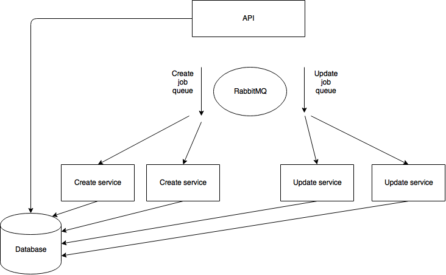
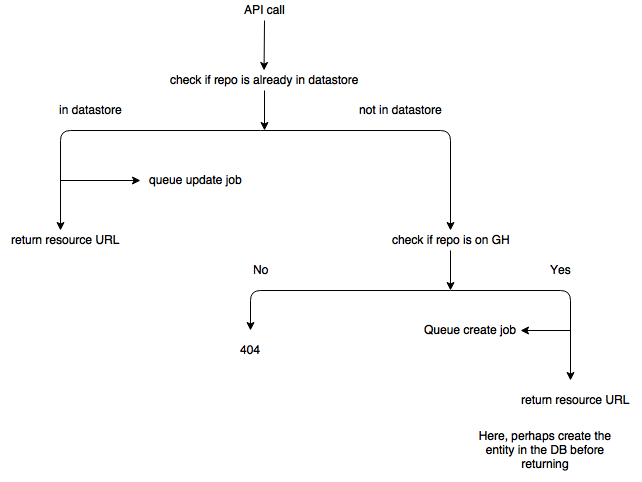
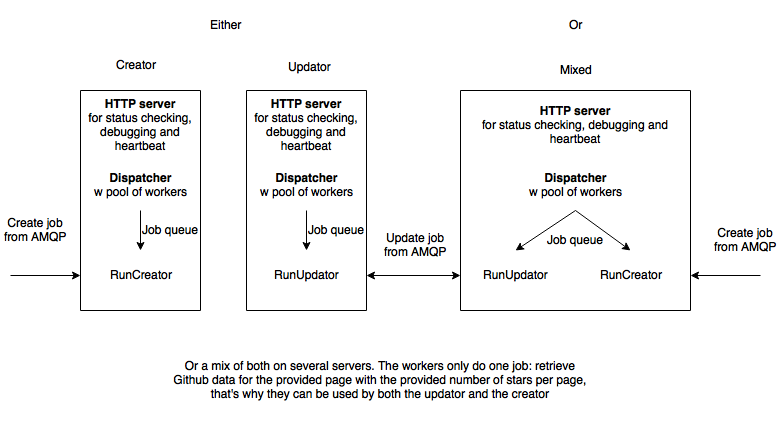

# Stargraph
## The perfect tool to plot a chart of stars on Github repositories

There is a CLI where you provide your Github API token via `-t` and the `:username/:reponame` via the `-r` parameters.
If you don't have a Github API token, you will be restricted by the API to 60 calls per hours.

An example on how to use it:
```
stargraph -t githubtoken -r evermax/stargraph
```

To get the project, just do `go get github.com/evermax/stargraph`

The program will produce 3 files:

 - graph.png which contains the graph plotted with [gonum/plot](https://github.com/gonum/plot). It currently doesn't support date display so you will end up with Unix timestamp on the X-axis
 - canvasDB.json which contains graph data to be used with [CanvasJS](http://canvasjs.com)
 - jqplotDB.json which contains graph data to be used with [jqplot](http://www.jqplot.com)

You can also now use the lib part of the project to get the timestamps of the stars on a repository as a `[]int64`

## Disclaimer
This tool only take the current stars on the repository and place them on a graph
where their are placed by order of apparences. That is why it will never provide you with a shrinking graph/a graph going down.

It is still a funny way to see it the repo has a good growth. You just need to pay attention to the last star date.

## Demo
I made a proof of concept for this project on [Stargraph.co](http://stargraph.co). You can there provide a Github API token or log in with Github and try it!

## Stargraph structure

The structure of the website should be something like this:



Where you have an API and a website talking to that API, asking for the backend to get the data for a Github repo.
If the repo does exist it will return a ressource URL where the client should query periodically to know if the data is ready.
Service job will then be triggered so that the data is fetched.


The services are divided in two: Creators and Updators. The creator will create a record in the database and get the data for the first time.
The updator will check if there was any change in the stars, if not it will just leave the data as it is, if so it will update the data that are not correct.


## Contributions
Contributions to that project are more than welcome, especially... for everything!
You are welcome to talk to me about it on [Golang slack](https://gophers.slack.com/messages/@maxime/). (If there is a need for it, I might make a channel)
[Request an invite](http://bit.ly/go-slack-signup) if you are not already on the channel.
